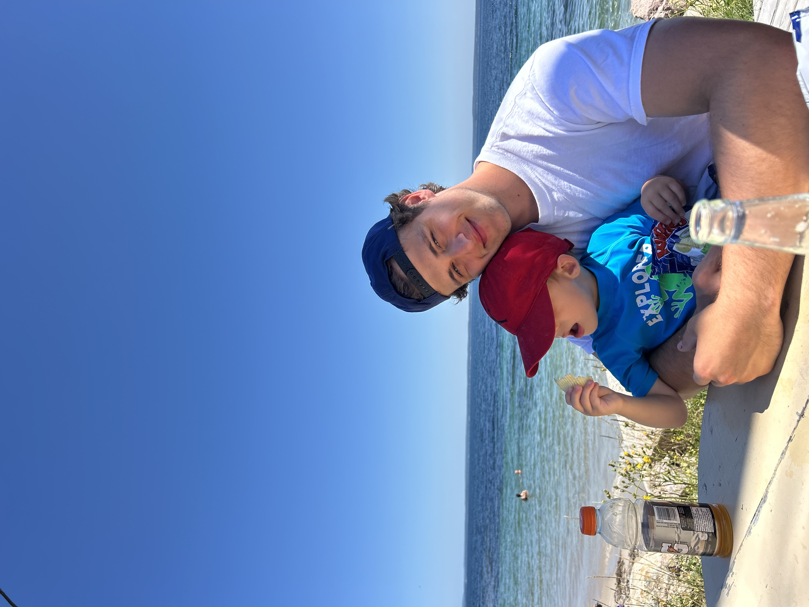

# Welcome to My ReadME 🙋🏼‍♂️
Hi! I'm <mark>**Fionn Clancey**<mark>, a fourth year <mark>**BSc Psychology**<mark>     
at <mark>**Dalhouse University**<mark>. 

### Why I Enrolled in this Class?
>Our *digital world* places a large emphasis on an individual's ***computer proficiency***. This may vary among different fields, but coding seems to be an invaluable tool that I may use in whatever direction I go.
>
>Aspects of this course seem to shape the individual not only in techanical proficiency, but in creating a well-rounded individual. Listed below are some of soft skills that prompted my interest in this course: 
>1. **Professional Development/Work Ethic Building**
>2. **Working effectively and efficiently in a team-based setting**
>3. **Effective Communication Skills**
>4. **Time Management** 

### What Got Me Interested in Psychology?
>My interest in Psychology stems from my need to better understand my own thought patterns/behaviors. This personal want to better understand myself manifested into a want to better understand the human behavior in ways of:
>- Relationship Dynamics
>- Tendencies/Prospectives of Different Demographics
>- Mental Illness

### What Are My Post-Graduation Plans?
>Following my graduation at the end of this school year, I hope to build my law school application through internships and volunteer practices. This will be compounded with finding work that both fits my intended schedule and makes this year feasible. I hope to be apart of the 2027/28 incoming class to the **Schulich School of Law** and to have a clearer understanding what law I would like to practice.

<!--
**FionnClancey/FionnClancey** is a ✨ _special_ ✨ repository because its `README.md` (this file) appears on your GitHub profile.

Here are some ideas to get you started:

- 🔭 I’m currently working on ...
- 🌱 I’m currently learning ...
- 👯 I’m looking to collaborate on ...
- 🤔 I’m looking for help with ...
- 💬 Ask me about ...
- 📫 How to reach me: ...
- 😄 Pronouns: ...
- ⚡ Fun fact: ...
-->
